# Fieldwatch UI plan — from the Whales critique

Branch `claude/whales-ui-critique-plan` · Whales project **Tower Defense Game** · review page: `index.html` (built from `plan.json` and `critiques.json`)

Whales critiqued 11 screens from one full run (menu → hero pick → run map → battle → spoils → merchant → defeat) on phone (390×844) and desk (1440×900). The designer confirmed every screen goal.

**Status (round 6).** Rounds 1–3 and no hero HP are built; LS3 and LS4 (easy to pick up) are being built. Round 6 lists the calls the builders made, for your review. Q2, Q6, Q7, Q9, Q11, Q13 and Q14 became the round-4 proposals (skill system, levels, exact stats, spreading fire), together with the Hall of Champions idea. Q15 is parked.

Round-1 screenshots are in `shots/`; the latest build is in `after/`. `scripts/flow-shots.mjs` recaptures both.

## Round 6 · what the builders decided

No hero HP and the round-3 answers are built. The builders made these calls on the way; keep the default, change it, or drop it.

### N1 · Bombers and the King now target the Gate. Keep that?

*From NH1*

- Bombers stop within 450px of the Gate and lob a charge at it; the landing spot is marked on the road so you can kill them during the wind-up.
- The Powderkeg King lobs TNT at the Gate on a timer instead of at heroes.
- My recommendation: keep both. They make 'kill the dangerous ones first' the whole lesson, which fits 'easy to pick up'.

### N2 · Content cut with hero HP

*From NH1*

- These relics and mutations only made sense with hero HP and were removed: Close Quarters, Last Rampart, Stormcharged, Cornered.
- Elites lost their extra ×1.1 enemy strength; they're harder only through what they bring.
- Keep them cut, or should any come back with a new trade-off?

### N3 · "Not a Scratch" opens nothing

*From NH1*

- The feat 'beat an act boss without the Gate losing HP' now unlocks nothing; it's a feat for its own sake (plus 60 Marks).
- Fine as is, or should it unlock something (a cosmetic, a banner)?

### N4 · Two balance checks are still slightly red

*From NH1*

- Starting with one hero and fighting every battle: 41% of runs end at the first elite (the limit is 40%).
- Field Kitchen + Relic Cartulary together measure −6 points on the battles route (the noise floor is ±5).
- My recommendation: leave both until the cuts and merges (LS1, LS2) land, then tune once. Chasing a point now would be undone by those changes.

### N5 · Vow 1 (Thin Pickings) sits on its own noise floor

*From NH1*

- Thin Pickings (two reward cards instead of three, fewer relics) costs between −1.5 and +5 points depending on unrelated curve details. It's still harder in the full report (5.5–6.8 points), but the ladder's first rung is weakly separated.
- Leave it, or make the first Vow bite harder (for example one card fewer and no merchant restock)?

### N6 · Zoom to place: the 2× jump

*From Q3*

- On small phones the only crisp zoom that clears 44px tiles is 2× (a 2.3–2.9× visual jump). At 320px wide you see about 4 × 4 tiles while zoomed.
- The between-waves move doesn't zoom yet.
- Try it on a small phone: is the jump too far, and should the move zoom too?

### N7 · The seed chip made the hero pick taller

*From Q8*

- The Daily and seed lines add about 52px, so on a 390×844 phone the Vow chips now start just under the fold (they were 40px above).
- My recommendation: fine for now, since LS3 hides Vows until your first finished run anyway.

### N8 · Off-hand numbers

*From Q4*

- A knife or wand in the off hand counts at 50%; the Twinblade Harness lets a 14-DEX hero carry a sword or axe there at 100%.
- Axes count as one-handed and can go in the off hand with the Harness. Right numbers?

### N9 · Enemy card: when do you learn things?

*From Q10*

- Never met: name, a greyed portrait, armour. Met once: HP and pace. Felled 5 (1 for a champion): tricks, the counter and Gate cost.
- On 320px phones the card covers most of the small field while it's open.
- Are 1 / 5 the right thresholds?

### N10 · Menu title contrast on some days

*From Q12*

- Because the cinematic now changes daily, some fields put grey rocks under the wordmark: its worst contrast is 3.43:1 (large text needs 3:1, so it passes, but round 2 had 4.9:1).
- My recommendation: add a soft shade behind the wordmark so every day's scene clears 4.5:1.

## Round 5 · make it easier to learn

Your goal: 'The game should be easy to pick up.' A first run asks you to learn about 20 separate ideas. These proposals cut, merge and stage them. Hero HP is being removed now; LS3 and LS4 are low-risk and will be built right after it. LS1 and LS2 remove content, so they wait for your call.

### NH1 · Heroes are never hit

*Effort L · from Claude · done*

> **Your note on your call:** No let’s remove and adjust. Maybe wait to finish tuning after this

**Proposed change**

- Heroes have no HP and are never damaged or downed. The breather's 'mend and revive' goes away with it.
- Blocking stays and gets simpler: a Fighter still holds up to 2 enemies on the road, and thorns still hurt the enemies being held.
- Enemies that used to hit heroes hurt the Gate instead. Sappers and TNT goblins blow up at the Gate for extra damage if they reach it, bombers' charges land on the road ahead, and boss slams become Gate damage. Letting the dangerous ones through is what costs you.
- Survival stats leave the game rather than being converted: hero HP, armour/defence on heroes, and HP-based relics, perks and mutation downsides are removed or given a damage-based trade-off instead.
- Balance is tuned once, after this lands, together with Q1's danger tiles.

**Questions (answered by default when approved)**

1. Any enemy you'd want to keep a hero-facing threat, for example a boss that dazes heroes briefly, or none at all?

**Files:** `src/game/engine/engine.ts`, `src/game/data/enemies.ts, items.ts, relics.ts, perks.ts, mutations.ts`, `hero UI (HP bars, stats)`, `balance/`

**Result:** Built and tuned. Heroes have no HP; a Fighter still holds 2 and thorns still grind. Sappers walk past heroes and blow at the Gate; bombers plant within 450px of the Gate and lob a charge you can see coming; the Powderkeg King lobs TNT at the Gate on a clock. The HP bar, 'fell', 'heroes lost' and the Defence cells are gone. One tuning pass: the win rate went 83% → 57% (band 45–60%) and failing balance checks went 12 → 2, each within a point of its limit.

### LS1 · Cut what doesn't earn its place

*Effort M · from Claude · awaiting your decision*

**Proposed change**

- Patience: a stat that stacks +4% every 3 seconds up to a cap. Invisible in play; cut it.
- Dust, reforge and upgrade: a second currency and two crafting verbs. Cut them; scrapping an item gives gold.
- Curses on items: an epic-and-up affix that adds a hidden downside. Cut it; trade-offs live on relics only.
- STR/DEX/INT stay under the hood but come off the main screens. You see damage, speed, range and reach; the breakdown (SK4) shows the rest on request.
- Watch Commands stay: one clear, active button per sub-wave.

**Questions (answered by default when approved)**

1. Tick which of these to cut in your note (for example 'cut patience and curses, keep dust').

**Files:** `items, economy, combat, UI`

### LS2 · Merge systems that do the same job

*Effort L · from Claude · awaiting your decision*

**Proposed change**

- Perks, mutations and evolutions all answer 'how does this hero get better'. With SK1 they become one thing: skills.
- Relics and shrine boons are both 'a run-long bonus for the company'. Make them one kind, blessings, with one list, one icon and one place you see them.
- Map stops shrink to five kinds: battle, elite, merchant, rest (heal the Gate, or train one hero), and a blessing stop. Crossroads and shrines fold into the blessing stop.
- Result: a player learns one way heroes grow, one kind of bonus and five kinds of stop.

**Questions (answered by default when approved)**

1. Keep evolutions as their own moment at levels 10 and 20, or make them skill picks too?

**Files:** `skills (SK1)`, `relics + shrines`, `run map node kinds`

### LS3 · Teach in layers: new ideas arrive when they matter

*Effort M · from Claude · done*

**Proposed change**

- First battle: only 'post a hero, start the wave'. The Gate and gold are the only numbers on screen.
- Items appear after your first win, merchants from the second stop, blessings at your first elite, skills at a hero's first skill level, danger tiles and challenges from depth 3.
- Vows or difficulty, Daily Watch and Endless unlock after your first finished run. The menu shows them locked, each with one line on what unlocks it.
- Each new idea gets exactly one coach tip the first time it appears, then never again; the Codex keeps the explanations.
- Returning players see everything from the start; the layering only shapes a player's first runs.

**Questions (answered by default when approved)**

1. Too gradual, or about right for a first session?

**Files:** `src/ui/shell/Coach.tsx`, `run generation (first-run rules)`, `menu unlocks`

**Result:** Building now, after the no-HP change landed: first runs meet one idea at a time, with one name per thing.

### LS4 · One name per thing

*Effort S · from Claude · done*

**Proposed change**

- Heroes, not sentinels or towers, everywhere a player reads.
- 'Threat ×1.06' becomes 'Enemy strength +6%'.
- 'Watch Marks' become 'Marks' after the first explanation.
- A short glossary lives in the Codex. No term appears on screen before the player has met it.

**Files:** `copy across src/ui`

**Result:** Building now, after the no-HP change landed: first runs meet one idea at a time, with one name per thing.

## Round 4 · the bigger design changes

Your Q2 answer reshapes how heroes work, so it's written up here as a system before anything is built, with Q6, Q7, Q9, Q11 and Q14 folded in. Spreading fire (Q13) and your champions idea are here too. The seven clearer answers (Q1, Q3, Q4, Q5, Q8, Q10, Q12) are being built now.

### SK1 · Heroes with skills: 1 of 3 rolled heroes, a skill pool you grow across runs

*Effort L · from Claude · awaiting your decision*

> **Your note on Q2:** lets make heros more dynamic. there are a set of 3 basic skills you get to start. As you play you unlock levels of progress and you get a random skill every so often when leveling (this should not be super slow at first but it shouldnt unlock all the cards easily). If you beat the game you get a skill each time. but each time you beat the game the difficulty goes up a bit. you can turn it back down but you dont get another skill unless you beat your score when you win at teh same difficulty … you can pick 1 of 3 heros with the random skills … there should be Level 2, 3 skills too … 3 options at each level for 3 levels of skills. you can only equip 3 skills per hero and then it just bumps their stats and you pick which

**Proposed change**

- Where it starts from: heroes today are one of three classes (Fighter, Rogue, Mystic). They level on their own XP up to level 20, evolve at levels 10 and 20 (pick 1 of 3), and pick a perk at 5 and 15 (1 of 2). The tab labelled 'Skills' in the hero panel already shows those perks, so skills replace perks and the name stays.
- The skill pool: every skill has a tier (T1, T2, T3). You start the game with 3 basic T1 skills unlocked. The rest of the library is locked 'cards' you earn over time.
- Unlocks across runs: every run earns Watch XP (from depth, kills and wins). Each Watch level unlocks one random skill card. Early levels come quickly (about one every 1–2 runs), and the gap widens so the whole pool takes many runs. Beating the game also unlocks a card each time.
- Hero pick: instead of choosing a class, you're offered 3 heroes. Each has a class, a name and 1 random T1 skill rolled from your unlocked pool. As the pool grows, the combinations get more varied. Stats and the full skill text are one tap away.
- In a run, skills come from levelling: at three milestone levels (proposed 5, 10 and 15) the hero is offered 3 skills of that milestone's tier. T2 and T3 skills only ever appear as these level-up offers, never at hero pick.
- A hero equips at most 3 skills. Once all 3 slots are full, a new offer lets you swap one out (you pick which) or take a stat bump instead (you pick the stat).
- Items still matter in a run exactly as today.
- Difficulty after wins: each win raises your Watch difficulty one step (for example +8% enemy HP and one more elite per act). You can lower it at the start of a run, but a win only unlocks a new card if it's at your highest difficulty, or if you beat your best score at the difficulty you chose.
- What this replaces: perks (levels 5/15) become skill milestones, and the Banner/Vow ladder is replaced by this difficulty step. Evolutions at 10 and 20 stay unless you say otherwise.
- This also answers Q6, Q7 and Q9: the pick serves every player the same way (three rolled heroes), no recommendation is needed, and STR/DEX/INT move into the stat breakdown (SK4).

**Questions (answered by default when approved)**

1. Keep evolutions at levels 10 and 20 alongside skills, or fold them into the skill milestones?
2. When all 3 skill slots are full: swap or stat bump (as proposed), or stat bump only?
3. Starting library size: I'd propose about 12 T1, 12 T2 and 9 T3 skills, built from today's 18 perks, 15 mutations and the evolution effects. Enough to start?
4. Should the 3 starting T1 skills be the same for everyone, or one per class?
5. Replace the Banner/Vow ladder with the difficulty step, or keep both?

**Files:** `src/game/data/skills.ts (new)`, `src/game/run/skills.ts (new)`, `src/state/metaStore.ts (pool, Watch level, difficulty)`, `hero pick (HeroPickVariants → one screen)`, `LevelUpPanel / PerkPanel → skills`, `balance/`

> **My read, not Whales':** Against 'easy to pick up', this is heavy as written: three tiers, a card pool, unlock levels and a difficulty ladder. The lighter version I'd build: each hero shows one skill at pick, gets one new pick at levels 5 and 10 (3 options each), holds at most 3, and unlocks happen quietly in the background with no ladder to manage. Tell me which you prefer in your note.

### SK2 · Levels and badges, explained, and what changes with skills

*Effort S · from Claude · awaiting your decision*

> **Your note on Q11:** level on getting xp for towers. each tower levels on its own. dont remember what badges are exactly or how it should integrate. tower lvl or run lvl

**Proposed change**

- It's per tower already: each hero earns its own XP from the waves it fights (half split evenly, half by kills) and levels on its own, up to 20. The run has depth (1–12), not a level.
- The 'Lv 3 ↑' badge from round 2 marks a hero with a level-up waiting for your choice. Tap it and the choice opens in the panel under the field.
- With SK1, the badge only appears when there's a real choice: a skill milestone (pick 1 of 3, or swap or stat bump) or an evolution. Plain level-ups just show '+1 level' briefly with the stats gained, with no badge to clear.

**Questions (answered by default when approved)**

1. OK to drop badges on plain level-ups (no choice) as described?

**Files:** `src/ui/shell/levelUps.ts`, `src/ui/shell/LevelUpPanel.tsx`

### SK4 · Exact numbers: a stat breakdown, and before/after on every item and skill

*Effort M · from Claude · awaiting your decision*

> **Your note on Q14:** is it possible to show accurate adjustments to the heros and their items and skills

**Proposed change**

- Yes. The engine already combines every source (class, levels, gear, skills or perks, relics, mutations, shrines) in one place, so the UI can show exact numbers rather than estimates.
- Tap the hero's stats in the panel for a breakdown. Each stat reads base → +gear → +skills → +relics → final (for example 'Damage 26 → 34 → 41 → 45'), including STR/DEX/INT and what they feed.
- Every item, skill offer, relic and shrine choice shows its exact before/after on that hero: '+7 DPS (60 → 67)', 'Range 168 → 185'. If it affects the whole company, it says so per hero.
- Tests hold the numbers shown to what the engine computes, so the display can never drift from what happens in battle.

**Questions (answered by default when approved)**

1. Default to DPS as the headline number, or damage per hit?

**Files:** `src/game/engine/combat.ts (breakdown helper)`, `DetailBand hero panel, item panel, LevelUpPanel`, `tests/`

### FX1 · Spreading fire you can see coming, and have to move for

*Effort M · from Claude · awaiting your decision*

> **Your note on Q13:** hmm how would this be countered. what if it spreads to a spot im using, do i just have to move my tower. i wouldnt want to lose it. That could be interesting it forces you to move your towers as you play. the spread is random too

**Proposed change**

- On Wildfire battles, fire spreads 1–2 tiles after each sub-wave, picked at random from the seed. You never lose a hero to it.
- Counterplay by warning: the tiles fire will spread to next are shown with smoke one sub-wave ahead, so you can move before it lands.
- If fire reaches a hero, that hero is Scorched (a burn that reduces damage) until it moves, and the next held sub-wave gives a free extra move for scorched heroes, so moving never costs your one normal move.
- Fire stops at water, the road and rocks; lakes (Flooded meadow) are firebreaks. Frost heroes' hits put out a burning tile next to them, giving the Mystic's Frost line a job.
- It fits Q1's danger tiles: burning ground behaves like a danger tile that moves.

**Questions (answered by default when approved)**

1. Should fire also hurt enemies walking through a burning tile on the road edge?
2. Is 1–2 tiles per sub-wave the right pace, or once per wave?

**Files:** `src/game/run/terrain.ts`, `src/game/engine (scorch status)`, `overlays (smoke telegraph)`

> **My read, not Whales':** Spreading fire adds a rule to learn mid-battle. I'd hold it until the first-run layering (LS3) is in, then introduce it on later depths only.

### HC1 · Hall of Champions: every run's company kept, your top 3 on the menu

*Effort M · from Claude · awaiting your decision*

> **Your note on your idea:** you could have a history of you champions somewhere from all your runs and grouped by run. then you can show off your top 3 on the loading screen. click to see stats of the run

**Proposed change**

- Every finished run is saved to your history: date, seed, difficulty, result, depth, score, and its company. For each hero: name, class, level, skills, gear, kills, damage and time on the field.
- A 'Hall of Champions' row on the Watchtower menu opens the history grouped by run (newest first), with filters for wins, Daily runs and class.
- Your top 3 champions stand on the title/menu screen as small pixel portraits with name and title (for example 'Doyle, Warden of Ash · 12 depth · 1,840 dmg'). Tap one to see that run's stats card, with a 'Play this seed' button.
- The menu cinematic (Q12) could cast your top champions as the heroes in today's scene.
- History is stored locally with the other progress, capped at a sensible number of runs (the top 3 are always kept) and validated on load like the rest of the save.

**Questions (answered by default when approved)**

1. 'Top' by what: the run's score, or the single hero's damage or kills?
2. By 'loading screen', do you mean the main menu, or a separate splash while the game loads?
3. Cast your champions in the menu cinematic?

**Files:** `src/state/metaStore.ts (history)`, `src/ui/shell/PageScreens.tsx (menu row, Hall page)`, `MenuKeyArt (top 3)`, `src/state/runSnapshot.ts (validation)`

> **My read, not Whales':** Pure reward with nothing to learn, so it fits 'easy to pick up' well.

## Round 3 · open questions

Everything in round 2 is built. These are the calls I made on your behalf, and the ones the builds turned up. Keep default leaves it as built; Change it means tell me in the note; Drop it removes the behaviour. The first four block progress.

### Q1 · Free placement made the game too easy. Which lever brings it back?

*From G1-2 · **blocks progress***

- Balance now fails 13 checks: the win rate went from 59% to 80% (the target band is 45–60%). The best tile sees 720px of road against 567px for the best old circle, and a full company can stand on that ground together.
- Options: (a) more fixed rocks and water on the high-value ground, (b) a map challenge on every eligible battle, (c) retune the Threat curve, (d) limit how close to the road a hero may stand.
- My recommendation: (a) first, since it keeps placement interesting, then a small (c) if needed. Nothing is tuned yet, and the CI balance job fails until you choose.

### Q2 · Which hero-pick direction should become the real screen?

*From H3-2 · **blocks progress***

- A · Play-style cards: all three heroes as cards with a looping attack, one sentence on how they fight, and three big numbers.
- B · Compare: a side-by-side table with bars. The most complete, but the longest on a phone.
- C · Recommended: opens on one suggested hero with its reason; the other two are a tap away. The best fit on a phone.
- The builder's lean, and mine: A as the base, with C's recommendation on a first run only. Try them in the game with ?heropick=cards, ?heropick=compare and ?heropick=recommend.

### Q3 · Tiles on small phones are under the 44px touch floor. Bigger tiles, or zoom to place?

*From G1-2 · **blocks progress***

- At 375×667 and 320×568 a tile is about 35px. Bigger tiles mean fewer of them on the field; zoom-to-place keeps the grid and enlarges it while you choose.
- Default: none built yet. My recommendation is zoom-to-place on screens under 390px wide.

### Q4 · Ambidextrous: full off-hand damage or reduced, what rarity, and what name?

*From R3-2 · **blocks progress***

- As built: the off-hand weapon counts in full, the relic is rare and in the pool from the start, and it's called 'Ambidextrous'. The balance model shows it as about neutral.
- Alternatives: count the off hand at 50%, lock the relic behind a feat, or give it an object name like the other relics ('Ambidexter's Gauntlet').

### Q5 · Is it OK that one-handed weapons no longer go in the off hand without the relic?

*From R3-2*

- Dual-wielding used to be free, so 'becomes a bonus' meant taking it away by default. Before G1, this moved the fresh-player win rate from 14% to 13% (the band starts at 15%). G1 then made the game much easier overall.
- Saves already wearing an off-hand weapon keep it. Should loading such a save move the weapon to the pack instead?

### Q6 · Who is the hero pick for first: a brand-new player, or a returning player choosing a strategy?

*From H3-2*

- Default: a brand-new player on their first run. If returning players matter more, the Compare direction moves up.

### Q7 · What should a first-run recommendation rest on?

*From H3-2*

- As built: easiest to place. The Rogue reaches farthest, so where you post it matters least.
- Alternatives: the Fighter, whose blocking is the clearest cause and effect on the field, or no recommendation at all.

### Q8 · Fix the Daily Watch problems on hero pick now?

*From H3-2*

- The Vow buttons show but do nothing. Typing a seed quietly turns the Daily into a custom-seed run. The screen also doesn't say that picking a hero uses up today's scored attempt.
- Default: fix all three in whichever direction you pick in Q2.

### Q9 · Hero pick details: STR/DEX/INT, the preselected hero, feats and the attack preview

*From H3-2*

- All three variants drop the STR/DEX/INT line. Today the Fighter is preselected, so one tap starts a run. Should the 'win with this hero first' feats show here? The attack preview runs at the real attack rate, so the Mystic looks slow.

### Q10 · Enemy queue: how to count overflow, and should portraits be tappable?

*From G2-2*

- As built: the first three kinds, then '+N', where N counts kinds, not enemies. Portraits are glance-only. Elites and specialists share their base goblin's picture. A held sub-wave shows only the next sub-wave, not all remaining.
- On desk the rail has room for more portraits, or names beside them.

### Q11 · Level-up badges: every level, and should they survive a reload?

*From G3-2*

- As built: plain level-ups get a badge too, and tapping it shows what grew. Badges aren't saved, so after a reload a pending evolution or perk falls back to the old modal. Take it is never blocked by a pending level-up.
- The field dims to about 50% behind the reward. Lighter or darker?

### Q12 · Menu battle: one fixed title shot forever, and should battle effects show?

*From H1-2*

- As built: always the same boss scene. Range rings, damage numbers and smoke show as they do in battle; hiding them needs renderer changes. Before the battle loads, the menu is dark and the battle fades up, with no still-image fallback.
- Should the scene ever change, for example by run progress or season?

### Q13 · Map challenges: how often, should fire spread, and water colour

*From G1-2*

- As built: about two battles in three have a challenge, never at depth 1 and never on a boss. Terrain is fixed per battle. Water is teal, which is also the tier-2 enemy colour.
- On touch, the range preview shows while your finger is held down. Should a first tap preview and a second tap confirm instead?

### Q14 · Paper doll: a drawn body, and a head slot later?

*From R3-2*

- The doll is a simple drawn body in the hero's colour, not the hero sprite. The sprites have their weapons painted in, so the sprite would show gear the hero isn't wearing. On narrow or Large UI phones the slots fall back to a stack.
- A head slot would mean new items, drops and a balance pass. Want it on the roadmap?

### Q15 · Whales still says the battle's next action reads quieter than the status bar. Push it further?

*From Whales re-check*

- On the re-check of the combined build, Whales' strongest repeat finding on the battle screens is that 'HELD · MOVE ONE HERO' and Next ▶ are outweighed by the header (FIELDWATCH, Depth, Gate, gold). The strip caption is 11px capitals.
- Options: a larger caption in the held state (e.g. 15px), a quieter header during battle, or leave it.
- Smaller things it flagged that I think are noise: 'the page heading is cut off' on desk (there is none), and cards 'covered' that are fully visible in the screenshots. The run map's encounter brief does scroll inside its panel, now a little sooner because the paper doll widened the gear column.

## Round 2 · your edits, reworked

You edited these six in round 1. Each is now a bigger change than the original item, so each has a phased proposal and open questions for you. Nothing here is built yet.

### G1-2 · Free-form deployment on a tile grid, with terrain that blocks

*Effort L · from Claude · done*

> **Your note on G1:** the whole deploy should be free form across a grid. any tile that isnt blocked by the environment or some reason for the map challenge, which should have some ui to show it like a rock or a fire, lake,  etc.

**What Whales found (round 1)**

- Battle setup (first deploy) #1: **Doyle's hero card doesn't lead the guided path**. hero card meant to be primary but styled well below it; screen reads as distributed focus, not the intended concentrated funnel
- Wave in progress #1: **The hero roster the tutorial points to is the weakest thing on screen**. Doyle's deployed card and the open recruit slot, bottom band — smaller and lower-contrast than the game title with "Depth 1/12" and the depth-1 wave readout with 4 enemies left

**Proposed change**

- Replace the six fixed build circles with a tile grid laid over the field. Any grass tile off the lane can take a hero; the lane, the forest frame and terrain pieces cannot.
- Blocked tiles are drawn as terrain you can read at a glance: rocks, trees, water, a campfire or a burning patch. With a hero armed, open tiles light up faintly and blocked ones stay dark, so the grid is only visible when you need it.
- Tapping a blocked tile says why in the coach strip ('Rock — nothing can stand here'), instead of doing nothing.
- Map challenges become terrain rules: 'Flooded meadow' adds lakes, 'Wildfire' adds fire tiles that spread between waves, 'Ruins' scatters rubble. Each battle's preview names the challenge.
- Keep the rules that make placement a decision: at most five heroes, and one move while a sub-wave is held.
- Phase 1: grid, free placement and blocking with today's terrain (lane and trees). Phase 2: terrain pieces and two map challenges. Phase 3: a balance pass, since free placement changes how strong every hero is.

**Questions (answered by default when approved)**

1. Grid size on a phone: a 7×12 portrait grid (about 48px tiles) keeps every tile a comfortable thumb target. Is that the feel you want, or finer?
2. Should range still show under your finger while you drag, before you drop the hero?
3. Fire that spreads between waves changes the map mid-run. Is that in scope for this game, or do you want terrain fixed per battle?

**Files:** `src/game/engine/engine.ts (slot → tile placements)`, `src/game/data/battlefields (blocked-tile masks)`, `src/game/render/overlays.ts (grid + blocked states)`, `src/game/render/terrain.ts (terrain pieces)`, `src/ui/shell/Coach.tsx`, `balance/ (placement assumptions)`

> **My read, not Whales':** This is a gameplay change, not a UI fix. Placements, the engine, maps and the balance report all assume fixed slots today, so it needs its own branch and a balance pass.

**Result:** Built phases 1–2: a 7×12 tile grid on phone (12×7 on desk), rocks, lakes and fire that block tiles, the reason on a blocked tap, Flooded meadow and Wildfire challenges named in the preview. Old saves move heroes to the nearest open tile. Phase 3 is open: free placement made the game much easier (win rate 59% → 80%), and the balance check fails until you pick a lever (Q1).

### G2-2 · One wave strip that changes with the moment, and shows who's still coming

*Effort M · from Claude · done*

> **Your note on G2:** maybe showing whick enenmies left to spawn or so on, find a way without making more ui/ taking up more space. consider dynamic ui than cna change to the current states need without removing actions or context that coudl still be needed

**What Whales found (round 1)**

- Wave in progress #3: **The instruction banner is losing the screen to ambient status**. "Sub-wave 1 of 2 held - tap a hero, then…" over the map stands out far less than the other primary messages; focus reads distributed, not concentrated
- Wave in progress (desk) #1: **The placement instruction doesn't lead — attention spreads across the sidebar**. the banner telling players to tap a hero then a post is styled well below its primary role; focus reads as distributed, not playfield-first

**Proposed change**

- Use the bottom wave strip you already have ('DEPTH 1 ▬▬ 4 left') and add no new UI. Its progress bar becomes the enemy queue: small enemy portraits in spawn order, next one first, with counts ('Torch ×3 · TNT ×1'). Spawned enemies drop off the front.
- The strip changes with the moment, and the depth label and the button stay put. Setup: the whole wave's line-up plus Start Wave. Live: the remaining queue plus speed. Held sub-wave: the next sub-wave's line-up, 'Held · move one hero' where the depth label was, and Next ▶. Cleared: gold earned plus Continue.
- This retires the separate banner over the top of the field, which gives the field its full height back.
- On desk, the same strip sits at the foot of the right rail, as it does today.

**Questions (answered by default when approved)**

1. When there are more enemy types than fit, show the first three and '+N'? Or scroll the strip?
2. Should tapping an enemy portrait show its stats in the detail band (the shell's one-interaction rule), or keep it glance-only?

**Files:** `src/ui/shell/DetailBand.tsx (wave strip)`, `src/ui/shell/StageBand.tsx (remove banner)`, `src/ui/shell/encounterPreview.ts`, `src/styles/shell-live.css`

**Result:** Built: the bottom strip is an enemy queue in spawn order, changing across setup, live, held and cleared. The banner over the field is gone, with the same screen-reader announcements.

### G3-2 · Wave cleared and spoils become one screen, and level-ups happen on the roster

*Effort M · from Claude · done*

> **Your note on G3:** this should also auto show what reward to pick and give details as you pick below, any level ups on characters should highlight the character on your ui and then be handled in there

**What Whales found (round 1)**

- Wave cleared #1: **Continue doesn't read as the main action**. the Continue button with its rewards confirmation in the footer is styled well below primary; whole screen reads as distributed focus, not concentrated
- Wave cleared #2: **A large image sits after Continue and pulls the eye past it**. a picture 33x the button's area in the button's own hue family follows it, as it does the "8 kills - 184 dmg" stats block
- Spoils #2: **The Take it confirm button doesn't read as the main action**. the single confirm button, one of the screen's primary messages, stands out far less than the elements around it

**Proposed change**

- Drop the hop from 'Wave cleared' through Continue to a separate Spoils page. When a wave clears, the field dims and a short result line shows (gold, XP, felled). The row under the field then fills with the three reward cards straight away.
- Tap a card and its details fill the panel below it (the Root Shell's one-interaction rule), with Take it as the one primary button. The first card is preselected, so the details are already showing.
- Heroes who levelled up glow on the roster with a 'Lv 3 ↑' badge. Tapping one opens that hero's level-up choice in the same panel, not a modal. Take it stays available, and the badge waits until you've dealt with it.
- The standalone Spoils page stays for elite and boss rewards, which deserve their own moment. Say if you want those merged too.

**Questions (answered by default when approved)**

1. Should Take it be blocked until pending level-ups are chosen, or can level-ups wait until the next stop?

**Files:** `src/ui/shell/WaveCeremony.tsx`, `src/ui/shell/SelectorBand.tsx`, `src/ui/shell/DetailBand.tsx`, `src/ui/shell/offers.ts (rewardOffers)`, `src/state/game/battleSlice.ts (continueAfterWave → reward)`

**Result:** Built: after a normal wave the three reward cards appear under the dimmed field with the first preselected, and Take it is the one button. Level-ups show a 'Lv N ↑' badge on the roster and are chosen in the panel. Elite and boss spoils keep their own page.

### H1-2 · Main menu: a cinematic battle behind the whole screen, with the menu on top

*Effort M · from Claude · done*

> **Your note on H1:** i love the improvement, and i like the movement of seing game going on, but maybe a bit rnadom. can you make it more cinematic and part of the BG of the screen, then the home UI can overlay

**What Whales found (round 1)**

- Main menu #1: **Game title and tagline don't read as the top of the page**. title and tagline block at the top, styled well below primary weight against the art scene and oversized teal "Start a Run" button
- Main menu (desk) #2: **"Fieldwatch" title reads weaker than its role**. Game title and tagline styled well below their intended secondary importance

**Proposed change**

- The attract-mode battle fills the whole menu screen behind everything on phone and desk, instead of sitting in a framed box.
- Make it directed rather than random: a fixed seed and a scripted ~20 second loop. The camera eases along the lane, a wave arrives, the knights hold, one big hit lands, then it resets on a fade. The same composition every time, so it reads as a title sequence.
- A dark vignette and a bottom-up gradient keep the title and menu rows readable. The rows become translucent panels over the art and still clear 4.5:1 contrast.
- The title gets the stronger treatment from H1 (larger, with a soft shadow), since it now sits on moving art.
- Reduced motion: the still key-art frame, exactly as today.

**Questions (answered by default when approved)**

1. On desk, should the battle take the whole width with the menu column floating on the right, or stay centred behind a centred menu?

**Files:** `src/ui/shell/MenuKeyArt.tsx`, `src/ui/shell/AttractMode.tsx`, `src/ui/attract/ (scripted sim + camera)`, `src/ui/shell/PageScreens.tsx (MenuScreen)`, `src/styles/page.css`, `src/styles/shell-wide.css`

**Result:** Built: one scripted ~19s boss scene fills the menu behind the rows, with the camera on whole pixels, a vignette and gradient, and a stronger title. Rows measured ≥9.4:1 over the brightest frame. Reduced motion shows today's still.

### H3-2 · Hero pick: a jobs-to-be-done pass before any redesign

*Effort M · from Claude · done*

> **Your note on H3:** yeah this whole screen needs a jobs to be done exercise

**What Whales found (round 1)**

- Hero pick #1: **The selected Fighter's stats don't read as the main content**. Fighter name and STR/DEX/INT stats in the detail panel, a primary message, styled well below primary importance
- Hero pick #2: **Focus is spread across all three options instead of the chosen one**. Screen reads as distributed focus, but the strategy calls for concentrated emphasis on the detail panel and confirm button

**Proposed change**

- I write the JTBD exercise as a doc for you to mark up: the job ('When I start a run, I want to pick a hero whose way of fighting I understand, so I can plan my first battles and feel it was my choice'), who is hiring the screen (first run, returning player, daily-seed player), the forces (push, pull, anxiety, habit), and what success looks like.
- From that, two or three layout directions as mockups, for example 'play-style cards' (one line on how the hero fights, a looping attack preview and three big stats), 'compare' (side-by-side stat bars), and 'recommended' (a suggested pick for a first run, with the reason).
- You pick a direction on this page, and only then does it get built.

**Questions (answered by default when approved)**

1. Who matters most on this screen: a brand-new player on their first run, or a returning player choosing a strategy?

**Files:** `docs/JTBD-hero-pick.md (new)`, `mockups (review page)`

**Result:** Done: docs/JTBD-hero-pick.md, plus three working layouts to try in the game: ?heropick=cards, ?heropick=compare and ?heropick=recommend. Today's screen is unchanged until you pick one (Q2).

### R3-2 · Gear as a paper doll: slots placed on the hero's body

*Effort L · from Claude · done*

> **Your note on R3:** I think the way equipment is shown could be way simpler. a little human body type model with the itom slots over it you know left hadn on lefgt head up top chest in middle etc. we should make gear slot based if not already  maybe some bonuess give you the option to do multi of a ceftain weapon in both slots  i think there is a larger edit than just the labels here

**What Whales found (round 1)**

- Wave in progress (desk) #3: **Sidebar labels and counters are too faint to read**. "CS 20/70" top-left #31261a on #342b1d = 1.1:1; the large "a: 4" readout 1.7:1; "HAND" top-right 2.8:1; +21 more
- Run map #2: **Readiness stats are hard to read at a glance**. "GEAR" #a18a6b on #4c4132 = 3.0:1, "64 DPS" #9d8769 on #48382a = 3.3:1, "HAND" #b19c7d on #534736 = 3.4:1, +9 more failing
- Run map #4: **The GEAR panel has no headline**. "GEAR" title 21px sits below its 25px body text, so the block reads as one flat run

**Proposed change**

- Gear is already slot-based: main hand, off hand and body. The change is how it's shown. The GEAR column becomes a small silhouette of the selected hero (the game already composites heroes wearing their gear in loadout.ts), with each slot sitting where it goes: main hand on the right, off hand on the left, body on the chest.
- Tapping a slot works as it does today: the pack filters to what fits, and tapping an item equips it.
- Dual-wielding becomes a bonus: a perk or relic ('Ambidextrous') lets the off hand take a main-hand weapon, and the off-hand slot outline changes to show it.
- This also fixes the desktop sidebar labels from round 1: the doll replaces the three stacked text slots that Whales flagged.

**Questions (answered by default when approved)**

1. Do you want a head slot? It would mean new items, new drops and a balance pass, not just UI. I'd leave it out of phase 1.
2. Dual-wield: a perk you pick, a relic you find, or a trait of one archetype (the Rogue)?

**Files:** `src/ui/shell/DetailBand.tsx (gear column)`, `src/game/render/loadout.ts (doll render)`, `src/game/data/items.ts (HERO_SLOTS)`, `src/game/data/relics or perks (Ambidextrous)`, `src/styles/shell.css, shell-wide.css`

**Result:** Built: the GEAR column is a small body (off hand left, body on the chest, main hand right) with ≥44px slots. Dual-wielding is the rare Ambidextrous relic, and without it one-handers no longer go in the off hand.

### A1-2 · A brighter primary button with dark text

*Effort S · from Claude · done*

**What Whales found (round 1)**

- Spoils #2: **The Take it confirm button doesn't read as the main action**. the single confirm button, one of the screen's primary messages, stands out far less than the elements around it
- Wave cleared #1: **Continue doesn't read as the main action**. the Continue button with its rewards confirmation in the footer is styled well below primary; whole screen reads as distributed focus, not concentrated
- Run map #1: **"March" doesn't read as the decisive action**. Back and March commit buttons styled below primary importance; "March" label #e4deca on #6f9498 = 2.5:1, below the 3:1 AA minimum at that size

**Proposed change**

- Whales flagged Take it, Buy and Continue as quiet on every pass, even after A1. The cause is measurable: today's button teal (#336e7e) is only 3.1:1 against the page, so it sinks into the dark brown.
- Switch every primary button to the game's lighter teal (#57a2b6, already --teal) with dark text (#1b1409, the --ink-on-fill the shell uses on solid fills). The label goes from 4.7:1 to 6.3:1, and the button from 3.1:1 to 6.1:1 against the page.
- It's one token change (--cta and --cta-ink), so every primary button moves together. High-contrast mode gets a matching pair.

**Questions (answered by default when approved)**

1. This changes the look from cream-on-deep-teal to dark-on-bright-teal. Is that trade OK for the game's feel?

**Files:** `src/styles/global.css (--cta, --cta-ink)`, `src/styles/app.css (high contrast)`, `tests/contrast.test.ts`

**Result:** Built: primary buttons are the lighter teal (#57a2b6) with dark text. Label 6.3:1, button 6.1:1 against the page, held by the contrast test.

## Readability

Text that fails WCAG AA contrast, mostly caused by dimming with opacity.

### R1 · Replace opacity dimming with AA-safe dim colours

*Effort M · from Whales · done*

**What Whales found (round 1)**

- Run map #2: **Readiness stats are hard to read at a glance**. "GEAR" #a18a6b on #4c4132 = 3.0:1, "64 DPS" #9d8769 on #48382a = 3.3:1, "HAND" #b19c7d on #534736 = 3.4:1, +9 more failing
- Battle setup (first deploy) #2: **Tutorial instruction text sits below readable contrast**. "PLACE IT" bottom-left 4.3:1, "recruit a hero" bottom-center 4.4:1, icon glyph mid-left #514c3a on #5a5a39 = 1.2:1
- Wave in progress #4: **Three status labels sit below the readable contrast line**. "recruit a hero" bottom-center at #ab9679 on #3d3225 = 4.4:1; "DEPLOYED" bottom-left 4.5:1; "SPEED" bottom-right 4.5:1
- Wave cleared #3: **Roster and status labels fall below readable contrast**. icon-like glyphs middle-right at 1.1:1 (#332a20 on #2d2619), "recruit a hero" and "DEPLOYED" both 4.4:1
- Main menu (desk) #1: **Menu column labels are too dim to scan**. "2026-09-29" at 2.8:1, "Watchtower" at 3.9:1, "Settings" at 4.2:1, +1 more, all middle-right, AA needs 4.5:1

**Proposed change**

- Add dim text tokens to global.css (for example --text-dim and --muted-dim) and check each against --panel, --panel-2 and --panel-3 so small text clears 4.5:1 and large text 3:1.
- Stop fading whole elements to show state: .sh-hero.empty (opacity 0.5, the 'recruit a hero' slot), .sh-btn:disabled (0.45), .map-node.cleared and .locked glyphs (0.72). Show the state with a dashed border or a dim token instead.
- Lift the labels Whales measured: GEAR, 64 DPS, HAND, DEPLOYED, SPEED, PLACE IT, recruit a hero, and the desktop menu's date and row labels.
- Add a small test (tests/contrast.test.ts) that computes contrast for every text-token and panel-token pair, so these can't regress.

**Files:** `src/styles/global.css`, `src/styles/shell.css`, `src/styles/shell-live.css`, `src/styles/page.css`, `tests/contrast.test.ts (new)`

**Result:** Re-checked: every contrast failure Whales measured on the phone's run map, battle setup, wave and wave-cleared screens is gone. Desk right rail: 24 failing labels down to 15; the rest are 11px labels at 1x on desk and move with R3-2.

### R2 · Make prices you can't afford readable

*Effort S · from Whales · done*

**What Whales found (round 1)**

- Merchant #2: **A price is invisible against its own background**. the "80" price, middle-right, #43331f on #413424 = 1.0:1, where WCAG AA needs 3:1 at this size

**Proposed change**

- .pg-row.dim fades the price and icon to 55% opacity. Keep the row marked as unaffordable, but render the price in a readable dim colour (at least 3:1) with a short 'need 18 more' hint, instead of fading it.

**Files:** `src/styles/page.css (.pg-row.dim)`, `src/ui/shell/offers.ts`

**Result:** Re-checked: the 1.0:1 price is no longer flagged, and 'need 20' shows beside a price you can't pay yet.

### R3 · Fix the desktop sidebar's faint labels and counters

*Effort S · from Whales · reworked as R3-2*

**What Whales found (round 1)**

- Wave in progress (desk) #3: **Sidebar labels and counters are too faint to read**. "CS 20/70" top-left #31261a on #342b1d = 1.1:1; the large "a: 4" readout 1.7:1; "HAND" top-right 2.8:1; +21 more

**Proposed change**

- Apply the R1 tokens to the desk layout's right rail (the Depth, gear and pack column heads, and their counters).
- Raise any 10px label to the 11px floor (--fs-micro).

**Files:** `src/styles/shell-wide.css`

> **My read, not Whales':** Whales read the header's 'GATE 20/20' as 'CS 20/70' and measured it at 1.1:1. The readable text is fine; the 1.1:1 is probably the header's dark ornament behind it. The rest of this row (HAND at 2.8:1, 10px labels) looks right.

## Icon legibility

Icons under Whales' 72 image px minimum (36 CSS px at 2×).

### I1 · Set an icon size scale and scale up stand-alone icons

*Effort M · from Whales · done*

**What Whales found (round 1)**

- Main menu #2: **Menu icons too small to recognise**. icons next to "Watchtower" 51x59, "Settings" 51x51, "Codex" 43x47 image px, +5 more, all under the 72 image px house minimum
- Main menu (desk) #4: **The icon beside "Fieldwatch" is unrecognisable**. Top-right icon measures 29x36 image px against a 72 image px house minimum
- Hero pick #4: **Perk and header icons are too small to recognise**. The two icons next to "Choose your first hero" (top-left and top-right) at 38x47 image px, an unlabelled bottom-left icon at 47x51, +8 more under the 72 image px house minimum
- Run map #3: **Roster and slot icons too small to identify**. The icon next to "BATTLE" 70x63, next to "Doyle" 64x64, next to "Open slot" 54x54 image px, plus two unlabelled icons at top-left and top-center, against a 72 image px house minimum
- Battle setup (first deploy) #3: **HUD icons are too small to recognise at a glance**. the icon next to "hi" 59x57, the icon next to "ig" top-left 57x57, an unlabelled top-right icon 36x35 image px, +9 more
- Wave in progress #5: **Four icons are too small to recognise**. Unlabelled icons top-left 57x56 and top-right 51x37, the icon next to "Sub-wave 1 of 2 held - tap a hero, then…" at 31x38, +1 more bottom-center
- Wave in progress (desk) #4: **Seven status and panel icons are too small to recognise**. icons beside "CS 20/70" at 43x58 and 31x38 image px, an unlabelled top-right icon at 44x44, +4 more, all under the 72px house minimum
- Wave cleared #4: **Icons are too small to recognise**. 7 icons under the 72 image px house minimum, including two unlabelled top-left and top-right at 57x56 and 53x45, plus the icon by "# Doyle > Lv3"
- Spoils #4: **Four icons are too small to recognise**. the icon next to "Take one. Each card says where it goes." at 51x51, two next to "Spoils" at 35x44 and 29x45 image px, +1 more; house minimum 72 image px
- Merchant #4: **Navigation and merchant icons are too small to recognise**. unlabelled top-right icon 51x51 image px, the icon next to "March on" 47x43, +3 more by "Merchant" — house minimum 72 image px
- Run lost #1: **13 icons are under the house minimum**. the icon next to "The Line Breaks" (top-left) at 41x45 image px and the icon next to "Return to the Watchtower" (bottom-left) at 47x43 image px sit well under the 72 image px house minimum, as do the icons next to "0 marks" and "Turn on Assist - Steady" (both 55 px wide) and 9 more

**Proposed change**

- Add --icon-sm 20px, --icon-md 28px and --icon-lg 36px to global.css, and use them everywhere instead of per-component sizes.
- Move stand-alone icons (menu rows, map node glyphs, the run-lost stat tiles, the Assist and Watchtower rows, empty gear slots) to --icon-lg (36 CSS px = 72 image px).
- Leave inline glyphs that sit beside a text label (gold coin, rarity pips, the Gate tower, the coach arrow) at --icon-sm. Their label already carries the meaning.
- Give the two unlabelled header icons Whales flagged a visible label or an aria-label, or remove them.

**Files:** `src/styles/global.css`, `src/styles/shell.css`, `src/styles/page.css`, `src/ui/shell/PageScreens.tsx`, `src/ui/shell/HeaderBand.tsx`

> **My read, not Whales':** Whales applies its 72 image px minimum to every icon, including glyphs that already have a text label next to them. I'd exempt those, which is the third bullet. Approve as written to keep that exemption, or use Edit to scale every icon.

**Result:** Re-checked: menu rows, map nodes, run-end tiles and exit rows are no longer flagged. Built at 48px, not 36px: the sprites only scale by whole multiples of 16. Still flagged: header marks and roster portraits, which weren't in this item's list.

## Primary actions

The one next step on each screen should be the strongest thing on it.

### A1 · One primary button style for the next step on every screen

*Effort M · from Whales · done*

**What Whales found (round 1)**

- Run map #1: **"March" doesn't read as the decisive action**. Back and March commit buttons styled below primary importance; "March" label #e4deca on #6f9498 = 2.5:1, below the 3:1 AA minimum at that size
- Wave in progress #2: **"Next wave" doesn't read as a primary action**. Wave control in the bottom band, meant to be primary-importance but styled well below it, and weaker than the screen's other primary messages
- Wave cleared #1: **Continue doesn't read as the main action**. the Continue button with its rewards confirmation in the footer is styled well below primary; whole screen reads as distributed focus, not concentrated
- Spoils #2: **The Take it confirm button doesn't read as the main action**. the single confirm button, one of the screen's primary messages, stands out far less than the elements around it

**Proposed change**

- The held sub-wave 'Next ▶' (.sh-command.ready) is outlined in gold, while 'Start Wave' is filled teal. Use the filled primary style for both, since each is the one thing to do next.
- March on the run map: make it the filled primary button, with Back as the quiet secondary, and fix its label contrast (Whales measured 2.5:1).
- Brighten --cta (#336e7e) slightly and add a 1px lighter top edge, so Continue, Take it and Run again stand out from the warm art without changing their colour.

**Files:** `src/styles/global.css (--cta)`, `src/styles/shell.css (.sh-btn.primary, .sh-command)`, `src/ui/shell/CommandSlot.tsx`, `src/ui/shell/DetailBand.tsx`

> **My read, not Whales':** Continue and Take it already use the filled teal button. I read Whales' 'styled well below primary' as the teal being too muted against the bright art, not as a missing style. The third bullet addresses that.

**Result:** Re-checked: Next ▶ and the roster are no longer flagged on the phone battle. Take it, Buy and Continue are still called quiet on every pass — see A1-2.

### A2 · Merchant: make your gold the headline number

*Effort S · from Whales · done*

**What Whales found (round 1)**

- Merchant #1: **The gold balance doesn't read as the screen's key number**. player's gold of 92 at the top, styled well below primary importance

**Proposed change**

- Enlarge the gold pill under 'Merchant' (display font, --fs-xl).
- Repeat the remaining gold on the Buy button ('Buy · 30 → 62 left'), so the budget is visible where you commit.

**Files:** `src/ui/shell/Page.tsx`, `src/styles/page.css`

**Result:** Re-checked: gold is display-size and Buy shows what's left ('→ 0 left'). Whales still calls the balance underweighted.

## Hierarchy & headlines

Titles and panel heads that don't outrank their body text.

### H1 · Stronger title on the main menu

*Effort S · from Whales · reworked as H1-2*

**What Whales found (round 1)**

- Main menu #1: **Game title and tagline don't read as the top of the page**. title and tagline block at the top, styled well below primary weight against the art scene and oversized teal "Start a Run" button
- Main menu (desk) #2: **"Fieldwatch" title reads weaker than its role**. Game title and tagline styled well below their intended secondary importance
- Main menu (desk) #3: **The intro block has no headline**. "Hold the meadow against the goblin horde" title is 16px against 14px body — near-identical

**Proposed change**

- Step the Fieldwatch wordmark up one level (--fs-display to about 40px on phone, 48px on desk) and add a light text shadow so it holds against the art.
- Keep the tagline small, but give it more space below the title so the title and tagline read as a pair.

**Files:** `src/ui/shell/PageScreens.tsx (MenuScreen)`, `src/styles/page.css (.pg-head)`, `src/styles/shell-wide.css`

### H2 · Give panel heads a real headline (GEAR, Depth)

*Effort S · from Whales · done*

**What Whales found (round 1)**

- Run map #4: **The GEAR panel has no headline**. "GEAR" title 21px sits below its 25px body text, so the block reads as one flat run
- Wave in progress #4: **Three status labels sit below the readable contrast line**. "recruit a hero" bottom-center at #ab9679 on #3d3225 = 4.4:1; "DEPLOYED" bottom-left 4.5:1; "SPEED" bottom-right 4.5:1

**Proposed change**

- Column heads such as GEAR and PACK are 11px uppercase, above 12–13px bodies. Keep them uppercase but raise the weight and use --text rather than --muted-2.
- The 'Depth 1/12' badge and its progress text are the same size. Make 'Depth N' the heading and the '/12' secondary.

**Files:** `src/styles/shell.css (.sh-col-head)`, `src/ui/shell/HeaderBand.tsx`

**Result:** Re-checked: GEAR and Depth now lead their blocks. PACK still measures 26px against 25px body text; I stopped at the three-round limit.

### H3 · Hero pick: make the selected hero's stats the main content

*Effort M · from Whales · reworked as H3-2*

**What Whales found (round 1)**

- Hero pick #1: **The selected Fighter's stats don't read as the main content**. Fighter name and STR/DEX/INT stats in the detail panel, a primary message, styled well below primary importance
- Hero pick #2: **Focus is spread across all three options instead of the chosen one**. Screen reads as distributed focus, but the strategy calls for concentrated emphasis on the detail panel and confirm button

**Proposed change**

- Keep the three hero tiles equal and a bit smaller. Move the scale into the detail panel: the hero name at --fs-xl, and DPS, range and HP as three large stat figures instead of one sentence.
- Keep 'Choose Fighter' as the one filled button.

**Files:** `src/ui/shell/PageScreens.tsx (hero pick)`, `src/styles/page.css`

## Battle guidance

The first-deploy and sub-wave instructions lose to ambient status.

### G1 · First deploy: spotlight the hero card

*Effort M · from Whales · reworked as G1-2*

**What Whales found (round 1)**

- Battle setup (first deploy) #1: **Doyle's hero card doesn't lead the guided path**. hero card meant to be primary but styled well below it; screen reads as distributed focus, not the intended concentrated funnel
- Wave in progress #1: **The hero roster the tutorial points to is the weakest thing on screen**. Doyle's deployed card and the open recruit slot, bottom band — smaller and lower-contrast than the game title with "Depth 1/12" and the depth-1 wave readout with 4 enemies left

**Proposed change**

- While the coach tip says 'Tap your hero', give the benched hero card a pulsing teal ring and a 'Tap me' label. Stop the pulse after the first tap (respect prefers-reduced-motion).
- Dim the Details button and the open recruit slot until the hero is posted.

**Files:** `src/ui/shell/Coach.tsx`, `src/ui/shell/SelectorBand.tsx`, `src/styles/shell-live.css`

### G2 · Stronger sub-wave instruction banner

*Effort S · from Whales · reworked as G2-2*

**What Whales found (round 1)**

- Wave in progress #3: **The instruction banner is losing the screen to ambient status**. "Sub-wave 1 of 2 held - tap a hero, then…" over the map stands out far less than the other primary messages; focus reads distributed, not concentrated
- Wave in progress (desk) #1: **The placement instruction doesn't lead — attention spreads across the sidebar**. the banner telling players to tap a hero then a post is styled well below its primary role; focus reads as distributed, not playfield-first

**Proposed change**

- The 'Sub-wave 1 of 2 held · tap a hero, then a post' strip is thin, light text on a translucent bar. Make it a solid banner with a readable size (--fs-md) and an icon.
- On desk, show it over the field, not the sidebar.

**Files:** `src/styles/shell-live.css`, `src/styles/shell-wide.css`, `src/ui/shell/StageBand.tsx`

### G3 · Wave cleared: end the reading order on Continue

*Effort S · from Whales · reworked as G3-2*

**What Whales found (round 1)**

- Wave cleared #2: **A large image sits after Continue and pulls the eye past it**. a picture 33x the button's area in the button's own hue family follows it, as it does the "8 kills - 184 dmg" stats block

**Proposed change**

- Darken the battlefield scrim behind the 'Wave cleared' card, so the card and the Continue footer are the only lit things on screen.

**Files:** `src/ui/shell/WaveCeremony.tsx`, `src/styles/shell-live.css`

> **My read, not Whales':** The 'large image after Continue' Whales flags is most likely the battlefield behind the overlay, not a separate picture. There's nothing to move, so I propose a darker scrim instead of Whales' 'move the picture above the button'.

## Layout & space

Empty space and chrome that push the decision below the fold.

### S1 · Close the empty gap on the Spoils, Merchant and Hero pick pages

*Effort S · from Whales · done*

**What Whales found (round 1)**

- Spoils #3: **Banners, filters and navigation crowd out the three cards**. 46% of the first screen, room for roughly 7.8 more items
- Merchant #3: **Banners, filters and nav crowd out the offers**. 29% of the first screen is chrome — about 4.9 more items could fit
- Hero pick #3: **Banners, filters and navigation crowd out the class details**. Banners, filters and navigation occupy 43% of the first screen — space for roughly 4.4 more items

**Proposed change**

- Spoils and Merchant leave about 64px of empty space between the pack strip and the list. Remove it, so the cards and the detail panel sit higher and more merchant offers fit above the fold.
- Keep the title and subtitle; there are no filter rows to cut.

**Files:** `src/ui/shell/Page.tsx`, `src/styles/page.css`

> **My read, not Whales':** Whales says 'banners, filters and navigation' take 29–46% of these screens. There are no filters. The real waste is the empty gap under the pack strip, which is what this item removes.

**Result:** Re-checked: Spoils chrome went from 46% to 31% of the first screen. Also applied to run end, so the taller I1 rows don't push the recap under the fade.

### S2 · Merchant: stop the last offer hiding under 'March on'

*Effort S · from Claude · done*

**Proposed change**

- In the capture, a 7th offer row peeks out behind the 'March on' row. Give the offer list its own scroll area with a fade, or move 'March on' into the footer next to Buy.

**Files:** `src/ui/shell/Page.tsx`, `src/styles/page.css`

> **My read, not Whales':** This one is mine, not Whales'. I spotted it in the screenshot.

**Result:** Re-checked: the last merchant row fades under 'March on' instead of cutting off, and isn't flagged.

### D1 · Dark art flags: no change

*Effort S · from Whales · done*

**What Whales found (round 1)**

- Hero pick #5: **Confirm whether the dark Fighter artwork is intentional**. The Fighter name and stats area is dark enough that faces or subjects may be hard to make out; may be a deliberate style
- Battle setup (first deploy) #5: **Confirm whether Doyle's dark portrait is intentional**. the hero card art is dark enough that the character may be hard to make out
- Wave in progress (desk) #5: **Confirm the dark hero roster art is intentional**. roster panel art for Doyle (Fighter 1, deployed) and the open recruit slot is dark enough that subjects may be hard to make out
- Wave cleared #5: **Confirm whether the dark roster art is intentional**. the Doyle (Fighter, Lv3, deployed) and open-recruit-slot roster is dark enough that faces may be hard to make out
- Spoils #5: **Confirm whether the dark card art is intentional**. the selected Bloodletting epic relic and the rare Piercing Bow are both dark enough that subjects may be hard to make out
- Merchant #5: **Confirm whether the dark item art is intentional**. six offer images incl. Executioner Greatsword of F, Frost Axe, Buckler dark enough that subjects may be hard to make out

**Proposed change**

- Whales asks on six screens whether the hero and item art is too dark. The pixel art is Tiny Swords at full brightness, and the portraits sit on bright orange tiles. I recommend no change unless you see a problem on a device.

> **My read, not Whales':** I think these are false positives from the dark UI panels around the art. Reject this item if you do want the art brightened.

**Result:** No change, as approved.

## Verify

Re-capture and re-critique after the fixes land.

### V1 · Commit the flow-capture script and re-critique after the fixes

*Effort S · from Claude · done*

**Proposed change**

- Add scripts/flow-shots.mjs, the Playwright script that played this run (menu → hero → map → battle → spoils → merchant → defeat) on phone and desk.
- After the fixes, re-capture and re-run Whales on every screen. Re-run the two reports that were cut off (both battle screens) and the run-lost screen on a real defeat.
- Add a line to docs/DESIGN_REVIEW.md's log.

**Files:** `scripts/flow-shots.mjs (new)`, `docs/DESIGN_REVIEW.md`

**Result:** Done: scripts/flow-shots.mjs is committed, and all 11 screens were re-critiqued on the final build. The loss is still forced, so run-end numbers aren't real.

## Whales critiques, round 1 (verbatim)

### Main menu · mobile 390×844

| Before | Latest build |
|---|---|
| 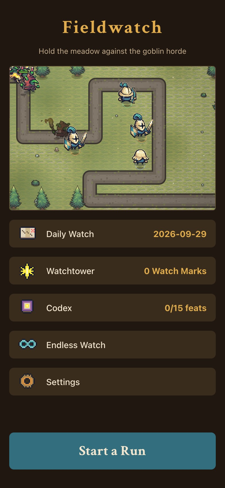 | 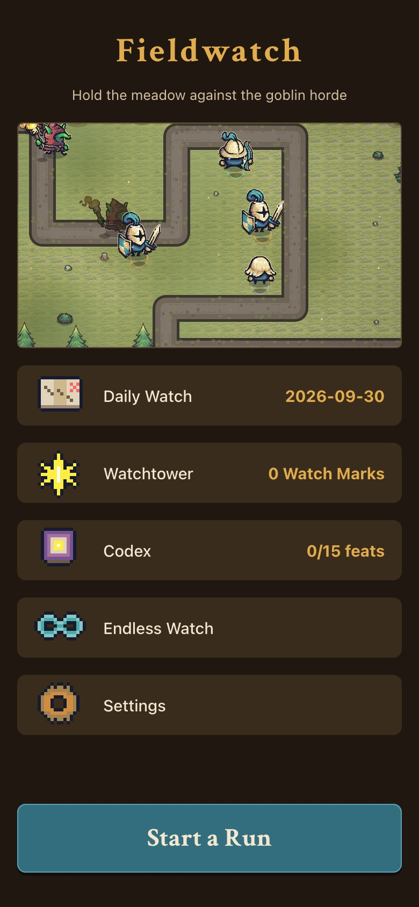 |

Critique id `4793a732-c544-4991-a827-6cfe86efdb00` · round-1 re-critique `88a74763-ea82-4bd8-9af6-8979a035bcd6` · goal (confirmed by the designer): "establish game tone and direct returning players to start playing"

Fieldwatch's title screen sets tone and points returning players to "Start a Run". The title and tagline are styled too quietly to carry that tone, and the menu icons are too small to read at a glance.

| # | Problem | What to do | Why |
|---|---|---|---|
| 1 | **Game title and tagline don't read as the top of the page** title and tagline block at the top, styled well below primary weight against the art scene and oversized teal "Start a Run" button | Raise the title's size, weight and contrast so it clearly outranks the menu rows below | Tone is sold in the top half; a quiet title leaves the screen to do that job alone |
| 2 | **Menu icons too small to recognise** icons next to "Watchtower" 51x59, "Settings" 51x51, "Codex" 43x47 image px, +5 more, all under the 72 image px house minimum | Make menu icons noticeably larger, or drop them and let the labels carry the rows | Returning players scan for "Daily Watch" and "Codex"; unreadable glyphs slow that scan |

### Main menu · desktop 1440×900

| Before | Latest build |
|---|---|
| 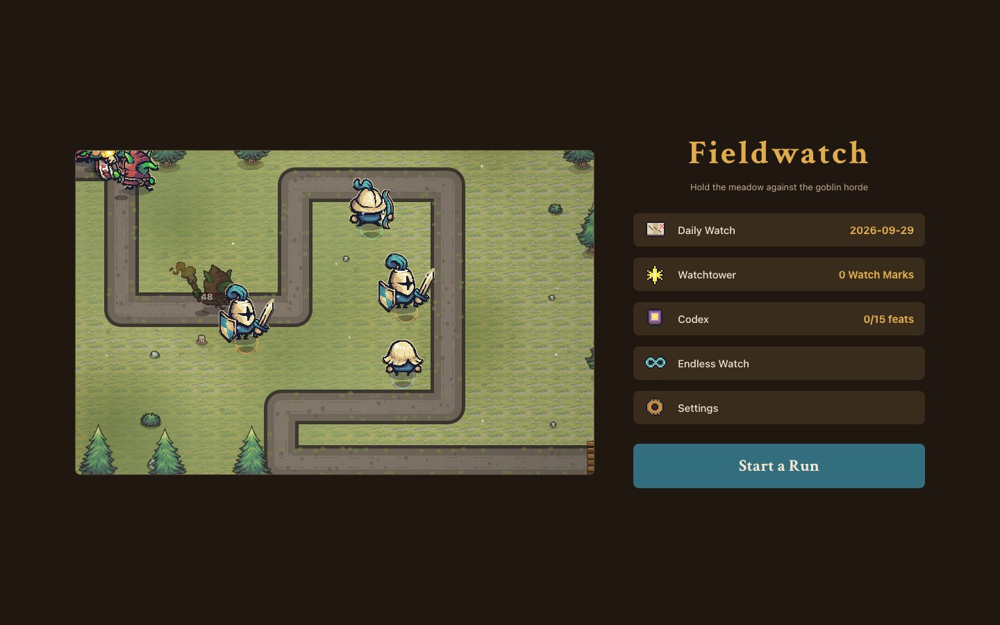 | 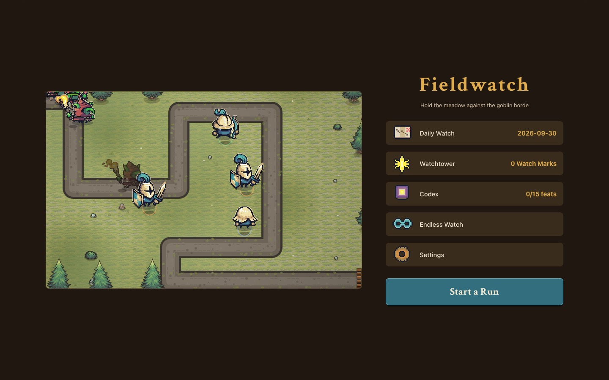 |

Critique id `55b6915a-63a1-4066-8b14-04654f0eeb26` · goal (confirmed by the designer): "get players into a run quickly from the main menu"

Fieldwatch's main menu sells the game with a looping preview while funnelling every choice into one right-hand column ending in "Start a Run". The column's labels sit below WCAG AA contrast, the title is underweighted, and its intro block has no headline.

| # | Problem | What to do | Why |
|---|---|---|---|
| 1 | **Menu column labels are too dim to scan** "2026-09-29" at 2.8:1, "Watchtower" at 3.9:1, "Settings" at 4.2:1, +1 more, all middle-right, AA needs 4.5:1 | Lighten the text colours (#c79945, #cec1ac, #cec2ac, #c69844) until each clears 4.5:1 on its brown | Every mode and meta choice lives in this column; dim labels slow the path into a run |
| 2 | **"Fieldwatch" title reads weaker than its role** Game title and tagline styled well below their intended secondary importance | Raise the title's size, weight or contrast so it clearly outranks the small mode rows | — |
| 3 | **The intro block has no headline** "Hold the meadow against the goblin horde" title is 16px against 14px body — near-identical | Push the title up in size and weight so it leads the block instead of blending into body copy | A flat block gives players nothing to land on before they hit "Start a Run" |
| 4 | **The icon beside "Fieldwatch" is unrecognisable** Top-right icon measures 29x36 image px against a 72 image px house minimum | Make the icon noticeably larger, or drop it if the title carries the branding alone | An illegible mark adds noise to a column that should read instantly |

### Hero pick · mobile 390×844

| Before | Latest build |
|---|---|
| 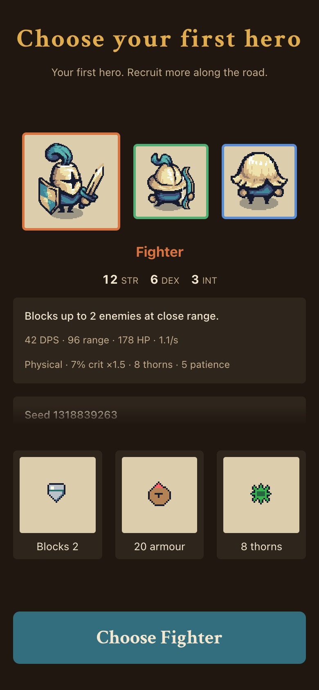 | 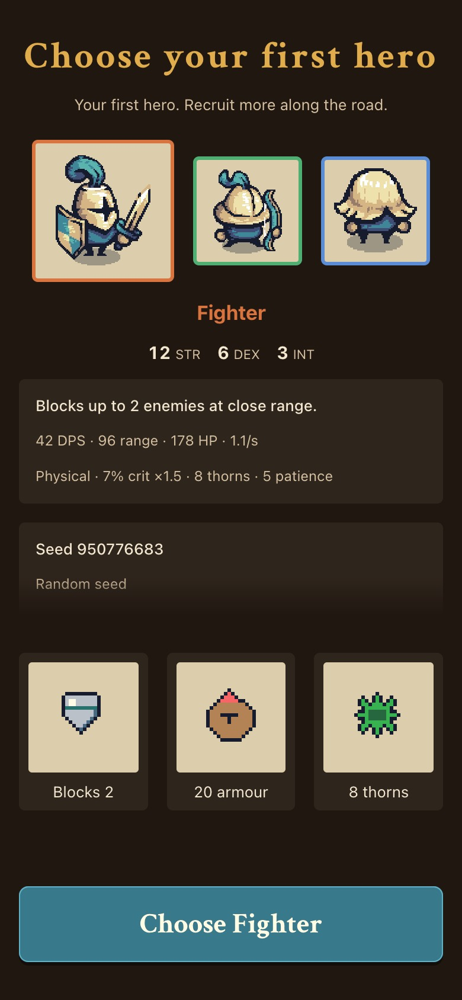 |

Critique id `6ca85703-8474-40fe-9695-dc2559d46bf9` · round-1 re-critique `c13b4034-fc58-4e9b-a156-a6d5259c6f6e` · goal (confirmed by the designer): "let user select and confirm a starting hero class"

This screen lets a player compare three hero classes and commit to one. The Fighter name and stats the choice rests on are styled too lightly, so all three options read as equal, and banners, filters and navigation eat 43% of the first screen.

| # | Problem | What to do | Why |
|---|---|---|---|
| 1 | **The selected Fighter's stats don't read as the main content** Fighter name and STR/DEX/INT stats in the detail panel, a primary message, styled well below primary importance | Raise the Fighter name and stat values in size and weight until they clearly outrank the three option tiles | The stat readout is what justifies the pick; if it reads as secondary, there is nothing to decide on |
| 2 | **Focus is spread across all three options instead of the chosen one** Screen reads as distributed focus, but the strategy calls for concentrated emphasis on the detail panel and confirm button | Keep the three option tiles small and equal, and push contrast and scale into the detail panel plus confirm button | Compare-then-commit only works if the selected class visibly dominates the two alternatives |
| 3 | **Banners, filters and navigation crowd out the class details** Banners, filters and navigation occupy 43% of the first screen — space for roughly 4.4 more items | Trim or collapse the banner and filter rows so the detail panel and confirm button sit higher | First-screen space should go to the class the player is evaluating, not surrounding chrome |
| 4 | **Perk and header icons are too small to recognise** The two icons next to "Choose your first hero" (top-left and top-right) at 38x47 image px, an unlabelled bottom-left icon at 47x51, +8 more under the 72 image px house minimum | Make these icons noticeably larger, or pair them with text labels where space is tight | Unreadable perk and header icons remove the visual shorthand players use to weigh one class against another |
| 5 | **Confirm whether the dark Fighter artwork is intentional** The Fighter name and stats area is dark enough that faces or subjects may be hard to make out; may be a deliberate style | Check on a real device; if unintended, lift exposure or add a scrim behind the name and stats | A murky hero image weakens the case for the class the screen is asking the player to commit to |

### Run map · mobile 390×844

| Before | Latest build |
|---|---|
| 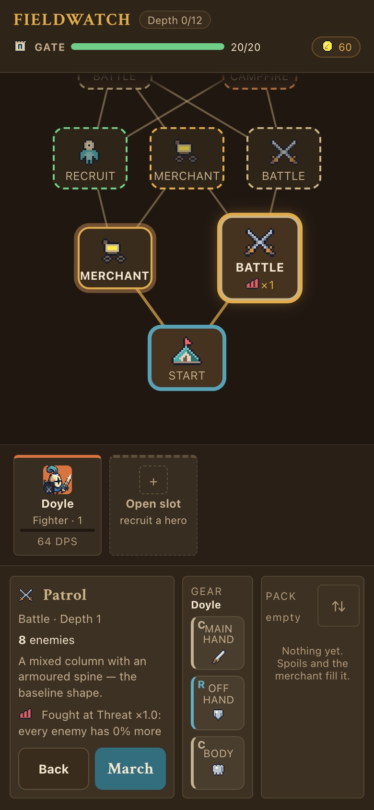 | 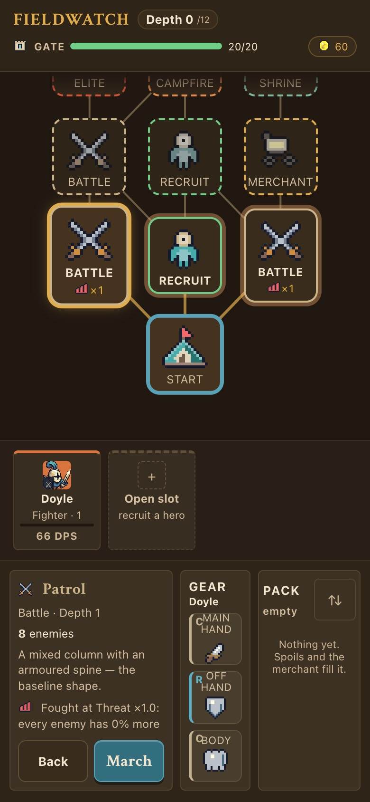 |

Critique id `925344e3-64b1-455a-a940-e2750ec80dbc` · round-1 re-critique `abb371f4-5df1-45c4-ae8c-82bc58e4f41e` · goal (confirmed by the designer): "let players evaluate their next move and party readiness before committing to a path"

Players use this screen to weigh the next map node against party readiness before committing to a path. But the March commit button is styled below primary importance, and the readiness labels it depends on — GEAR, DPS, equipment slots — sit at contrast levels that fail WCAG AA.

| # | Problem | What to do | Why |
|---|---|---|---|
| 1 | **"March" doesn't read as the decisive action** Back and March commit buttons styled below primary importance; "March" label #e4deca on #6f9498 = 2.5:1, below the 3:1 AA minimum at that size | Give March a stronger fill and weight than Back, and raise its label past 3:1 | The whole screen builds toward committing to a path; that step should be the clearest thing on it |
| 2 | **Readiness stats are hard to read at a glance** "GEAR" #a18a6b on #4c4132 = 3.0:1, "64 DPS" #9d8769 on #48382a = 3.3:1, "HAND" #b19c7d on #534736 = 3.4:1, +9 more failing | Lighten these label colours or darken their panels to reach 4.5:1 | Players cross-reference DPS and gear against encounter difficulty; unreadable numbers break that comparison |
| 3 | **Roster and slot icons too small to identify** The icon next to "BATTLE" 70x63, next to "Doyle" 64x64, next to "Open slot" 54x54 image px, plus two unlabelled icons at top-left and top-center, against a 72 image px house minimum | Make these icons noticeably larger, especially the unlabelled ones | Encounter type and empty gear slots are read by icon, not text, when scanning readiness |
| 4 | **The GEAR panel has no headline** "GEAR" title 21px sits below its 25px body text, so the block reads as one flat run | Make the GEAR title clearly larger or heavier than its body text | Support panels need scannable entry points when five blocks compete on one surface |

### Battle setup (first deploy) · mobile 390×844

| Before | Latest build |
|---|---|
| 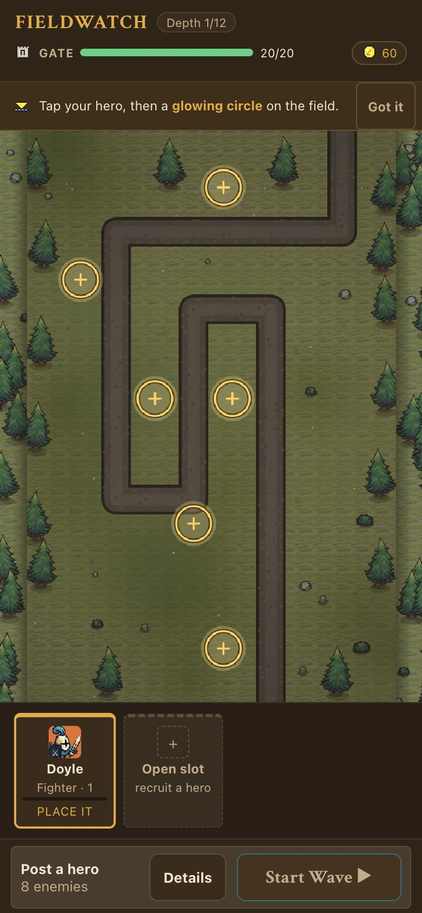 | 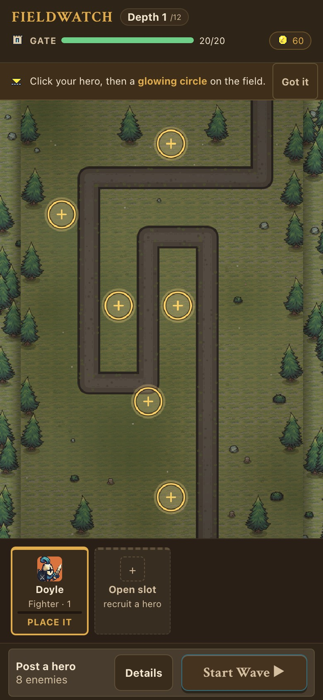 |

Critique id `12054830-f867-42bb-8b0e-be930d2d401a` · round-1 re-critique `90b58aa8-35ef-402d-a1b7-9f0153cb3fa1` · goal (confirmed by the designer): "guide new players through their first hero deployment without distraction"

The screen sets up a first hero placement before the wave starts. But the hero card the tutorial points to is under-styled, attention spreads instead of funnelling, and the instruction text and HUD icons fall below readable contrast and size.

| # | Problem | What to do | Why |
|---|---|---|---|
| 1 | **Doyle's hero card doesn't lead the guided path** hero card meant to be primary but styled well below it; screen reads as distributed focus, not the intended concentrated funnel | Make the hero card the loudest element — stronger glow, larger frame — and quiet the rest of the HUD | The first deployment depends on players spotting the hero to move into the glowing slot |
| 2 | **Tutorial instruction text sits below readable contrast** "PLACE IT" bottom-left 4.3:1, "recruit a hero" bottom-center 4.4:1, icon glyph mid-left #514c3a on #5a5a39 = 1.2:1 | Lift all three to 4.5:1 or better — lighten #c59744 and #ab9679, or darken the #483726 and #3d3225 panels | The banner is the only instruction a first-time player has for the hero→slot step |
| 3 | **HUD icons are too small to recognise at a glance** the icon next to "hi" 59x57, the icon next to "ig" top-left 57x57, an unlabelled top-right icon 36x35 image px, +9 more | Scale these icons up noticeably, past the 72 image px house minimum, or pair them with text labels | Unreadable HUD glyphs pull attention away from the single guided route |
| 4 | **Smallest labels fall under the house minimum size** "ig" center and one unlabelled glyph, center, both 10 image px against an 11px house minimum | Raise both above the 11px house minimum, or drop them if they carry no onboarding information | — |
| 5 | **Confirm whether Doyle's dark portrait is intentional** the hero card art is dark enough that the character may be hard to make out | If unintended, brighten the portrait or add a rim light so the hero reads clearly | Players are being asked to find and place this specific hero |

**Also noticed**

- Banners, filters and navigation occupy 69% of the first screen, leaving room for roughly 5.4 more items — expected for stripped-back onboarding, but worth confirming the chrome is all earning its place.

### Wave in progress · mobile 390×844

| Before | Latest build |
|---|---|
| 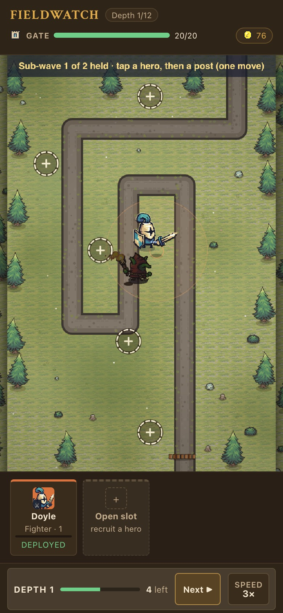 | 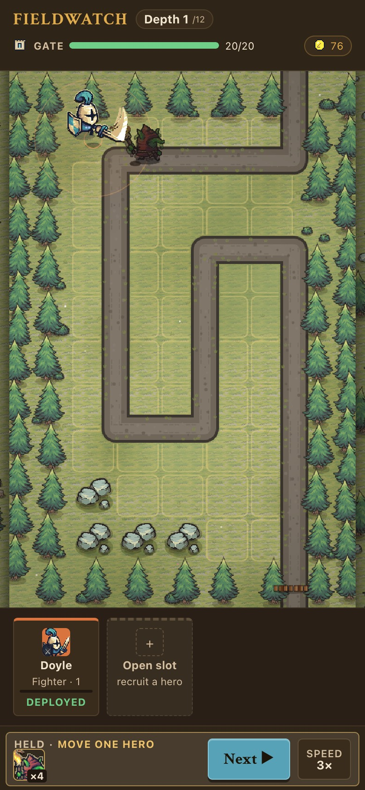 |

Critique id `eedbbabb-1011-47a7-901b-e40778c61b5d` · round-1 re-critique `da5cf798-f6f6-4110-b1dd-119de305cc56` · goal (confirmed by the designer): "guide new players through active tower-defense battles with clear next actions"

An active tower-defense battle meant to walk new players through one tap sequence. The pieces that sequence depends on — the hero roster, the instruction banner, "Next wave" — are outweighed by ambient status readouts, and small icons plus low-contrast labels add strain.

| # | Problem | What to do | Why |
|---|---|---|---|
| 1 | **The hero roster the tutorial points to is the weakest thing on screen** Doyle's deployed card and the open recruit slot, bottom band — smaller and lower-contrast than the game title with "Depth 1/12" and the depth-1 wave readout with 4 enemies left | Raise the roster cards' size and contrast above the top status readouts; quiet the title and depth block | The instruction tells a new player to tap a hero first, so the roster must be the loudest control |
| 2 | **"Next wave" doesn't read as a primary action** Wave control in the bottom band, meant to be primary-importance but styled well below it, and weaker than the screen's other primary messages | Give it a filled, high-contrast primary button treatment, larger than the surrounding roster chrome | It closes the tutorial's tap sequence; a new player needs to see where the turn ends |
| 3 | **The instruction banner is losing the screen to ambient status** "Sub-wave 1 of 2 held - tap a hero, then…" over the map stands out far less than the other primary messages; focus reads distributed, not concentrated | Strengthen the banner's contrast and size, and mute the resource and wave readouts around it | The banner is the only place a new player is told what to do next |
| 4 | **Three status labels sit below the readable contrast line** "recruit a hero" bottom-center at #ab9679 on #3d3225 = 4.4:1; "DEPLOYED" bottom-left 4.5:1; "SPEED" bottom-right 4.5:1 | Lighten each label until it clears 4.5:1 against its panel — aim nearer 7:1 for the small sizes | These labels explain hero state and controls mid-battle, when reading time is short |
| 5 | **Four icons are too small to recognise** Unlabelled icons top-left 57x56 and top-right 51x37, the icon next to "Sub-wave 1 of 2 held - tap a hero, then…" at 31x38, +1 more bottom-center | Make all four noticeably larger than the house minimum, or pair them with text labels | The banner icon carries the screen's main instruction; the others are unlabelled status |

**Also noticed**

- Confirm whether the dark treatment of Doyle's card and the open recruit slot is a deliberate style — subjects may be hard to make out.
- The "Depth 1/12" title and its body text are both 26px, so the block reads without a headline.

_Note: Whales' report was cut off at its token limit after these rows; the rest of "Also noticed" is missing. Re-run to regenerate._

### Wave in progress · desktop 1440×900

| Before | Latest build |
|---|---|
| 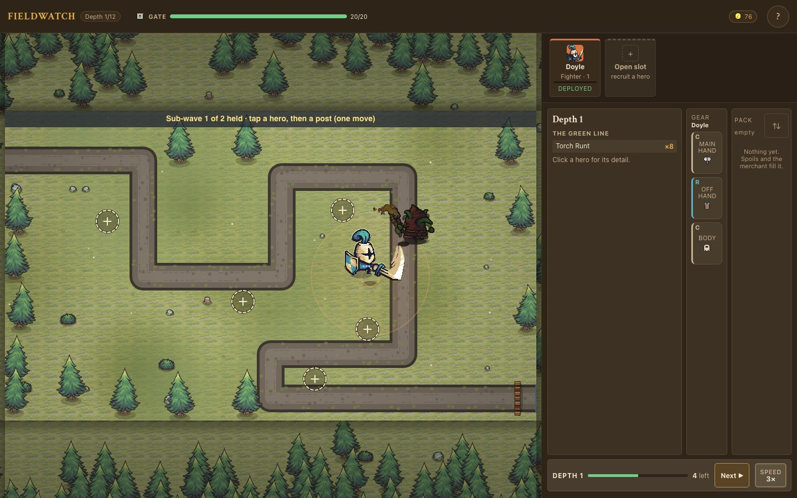 | 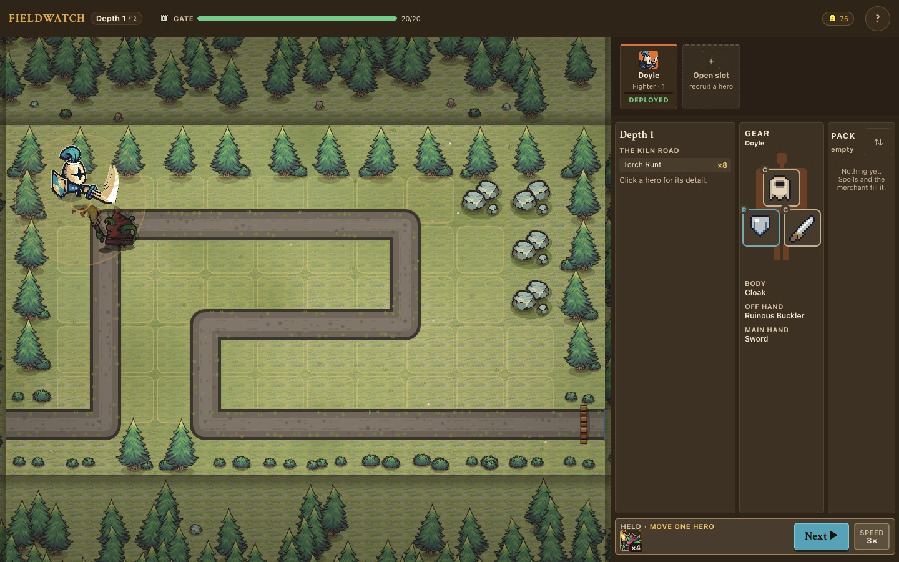 |

Critique id `e062149a-2159-4b73-8a1b-9fbd2658bf44` · round-1 re-critique `ad7fd232-b5e1-4f65-8351-4ce9d444b0b9` · goal (confirmed by the designer): "keep the player focused on the playfield while keeping reference data glanceable during hero placement"

This is the placement phase of a tower-defense battle: an open playfield on the left, reference panels on the right. The instruction that drives placement is styled too quietly to lead, the page heading is clipped away, and 24 text elements plus seven icons fall below readable contrast and size.

| # | Problem | What to do | Why |
|---|---|---|---|
| 1 | **The placement instruction doesn't lead — attention spreads across the sidebar** the banner telling players to tap a hero then a post is styled well below its primary role; focus reads as distributed, not playfield-first | Raise its size, weight and contrast above every sidebar panel, and quiet the right rail further | Placement depends on players reading the one-move instruction before tapping a hero onto a post |
| 2 | **The page heading is cut off at the top** large heading at the top of the content clipped to glyph fragments — nothing on screen states what the page is | Reveal the full heading inside the content area, or add a visible battle/phase title | Players have no on-screen confirmation of which battle or phase they are placing heroes in |
| 3 | **Sidebar labels and counters are too faint to read** "CS 20/70" top-left #31261a on #342b1d = 1.1:1; the large "a: 4" readout 1.7:1; "HAND" top-right 2.8:1; +21 more | Lighten text or darken panels to 4.5:1 (3:1 for the large readout); lift 10px labels to the 11px house minimum | Reference data only works if it is glanceable; at 1.1:1 these values are effectively invisible |
| 4 | **Seven status and panel icons are too small to recognise** icons beside "CS 20/70" at 43x58 and 31x38 image px, an unlabelled top-right icon at 44x44, +4 more, all under the 72px house minimum | Make these noticeably larger, or pair each with a text label | Wave, gear and inventory icons are reference cues the player must decode without leaving the playfield |
| 5 | **Confirm the dark hero roster art is intentional** roster panel art for Doyle (Fighter 1, deployed) and the open recruit slot is dark enough that subjects may be hard to make out | Check against the intended art direction; if unintended, lighten the art or raise contrast against the panel | Players choose which hero to place from this panel, so the portraits need to be identifiable |

**Also noticed**

- Banners, filters and navigation occupy 98% of the first screen, leaving room for roughly 7.4 more items.

_Note: Whales' report was cut off at its token limit; the rest of "Also noticed" is missing. Re-run to regenerate._

### Wave cleared · mobile 390×844

| Before | Latest build |
|---|---|
| 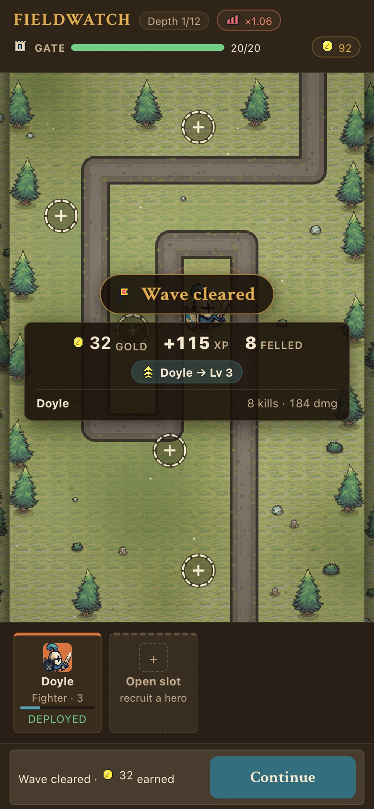 | 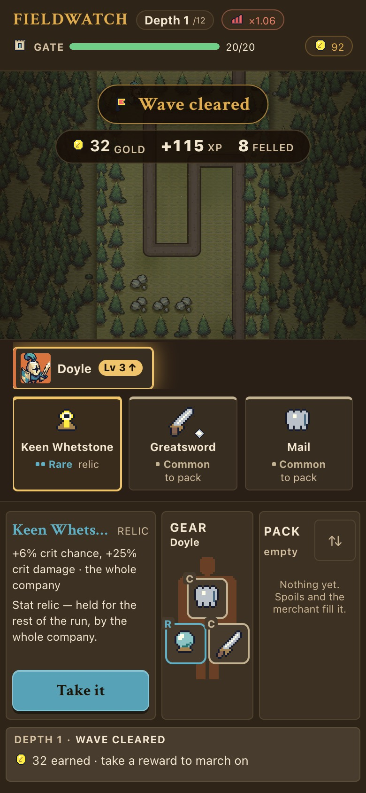 |

Critique id `86181611-6851-49a8-abe9-9561f6e82760` · round-1 re-critique `43d58d65-b643-4f2a-82b0-5903c50eacd8` · goal (confirmed by the designer): "display wave-clear outcome and rewards while presenting the hero roster and funneling the player to continue"

The screen delivers a wave-clear payoff and pushes the player to continue. But the Continue button and its rewards confirmation are styled well below primary and sit before a large image that pulls the eye past them, and several labels and icons fall under readable thresholds.

| # | Problem | What to do | Why |
|---|---|---|---|
| 1 | **Continue doesn't read as the main action** the Continue button with its rewards confirmation in the footer is styled well below primary; whole screen reads as distributed focus, not concentrated | Raise the button to full primary styling so it and the centered reward panel clearly outrank map and roster | The screen's job is to funnel the player onward; the exit is currently one voice among many |
| 2 | **A large image sits after Continue and pulls the eye past it** a picture 33x the button's area in the button's own hue family follows it, as it does the "8 kills - 184 dmg" stats block | Move the picture above the button so the button ends the block — don't just shrink it | Reading order should finish on the action, not drift into decorative art after it |
| 3 | **Roster and status labels fall below readable contrast** icon-like glyphs middle-right at 1.1:1 (#332a20 on #2d2619), "recruit a hero" and "DEPLOYED" both 4.4:1 | Lighten to at least 4.5:1; take the middle-right glyphs to 3:1 or above | "recruit a hero" is the progression hook the earned gold pays for and it is the hardest label to read |
| 4 | **Icons are too small to recognise** 7 icons under the 72 image px house minimum, including two unlabelled top-left and top-right at 57x56 and 53x45, plus the icon by "# Doyle > Lv3" | Make these noticeably larger, and label or drop the unlabelled top-corner ones | Hero and level icons carry roster meaning the player is being asked to act on |
| 5 | **Confirm whether the dark roster art is intentional** the Doyle (Fighter, Lv3, deployed) and open-recruit-slot roster is dark enough that faces may be hard to make out | Check against the intended art direction; brighten the card art if legibility matters more than mood | The roster is meant to sell the recruit hook, which needs a visible hero |

**Also noticed**

- Banners, filters and navigation consume 34% of the first screen — roughly 2.7 more items' worth of room.

### Spoils · mobile 390×844

| Before | Latest build |
|---|---|
| 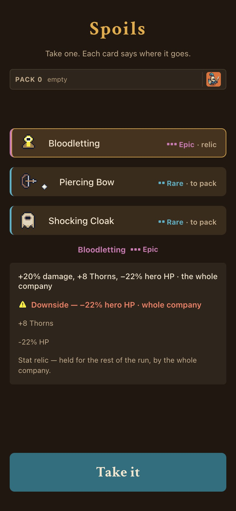 | 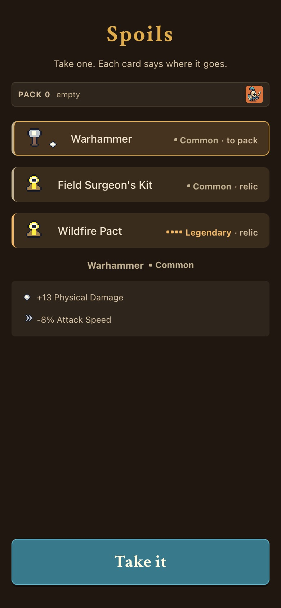 |

Critique id `e2564d10-76bf-45bc-98b4-6626759e73ab` · round-1 re-critique `fcc0ade2-3e14-4c68-94ea-eac942b29d5b` · goal (confirmed by the designer): "let players make informed tradeoff decisions when selecting post-battle rewards"

This screen asks players to weigh three mutually exclusive loot cards and commit to one. Right now the Piercing Bow option reads as weaker than its peers, the confirm button barely registers, and banners, filters and navigation eat 46% of the first screen.

| # | Problem | What to do | Why |
|---|---|---|---|
| 1 | **The Piercing Bow card reads as a lesser option, not a peer** the rare Piercing Bow card that goes to the pack, styled well below the primary importance it should carry next to the other two | Match its card treatment to the other options; reserve extra weight for the selected card only | Players can only judge a tradeoff if all three rewards read as equal-weight choices |
| 2 | **The Take it confirm button doesn't read as the main action** the single confirm button, one of the screen's primary messages, stands out far less than the elements around it | Give it a filled, higher-contrast treatment and more visual weight than any card element | It's the only way to commit once the player has settled the power-versus-cost call |
| 3 | **Banners, filters and navigation crowd out the three cards** 46% of the first screen, room for roughly 7.8 more items | Trim banner and filter height so all three cards and the detail panel sit above the fold | Comparison breaks down if stats, destination and the downside line need scrolling |
| 4 | **Four icons are too small to recognise** the icon next to "Take one. Each card says where it goes." at 51x51, two next to "Spoils" at 35x44 and 29x45 image px, +1 more; house minimum 72 image px | Scale these icons up noticeably, or pair each with a text label so meaning doesn't rest on the glyph | Destination and rarity cues are part of the information the tradeoff depends on |
| 5 | **Confirm whether the dark card art is intentional** the selected Bloodletting epic relic and the rare Piercing Bow are both dark enough that subjects may be hard to make out | Confirm this is a deliberate style; if not, lift image brightness until subjects read clearly | Art is the fastest way players tell the three options apart at a glance |

### Merchant · mobile 390×844

| Before | Latest build |
|---|---|
| 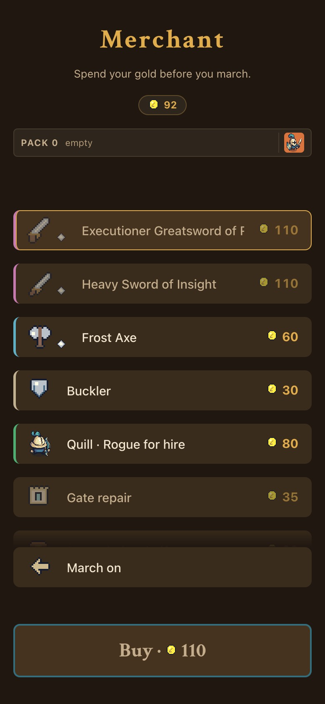 | 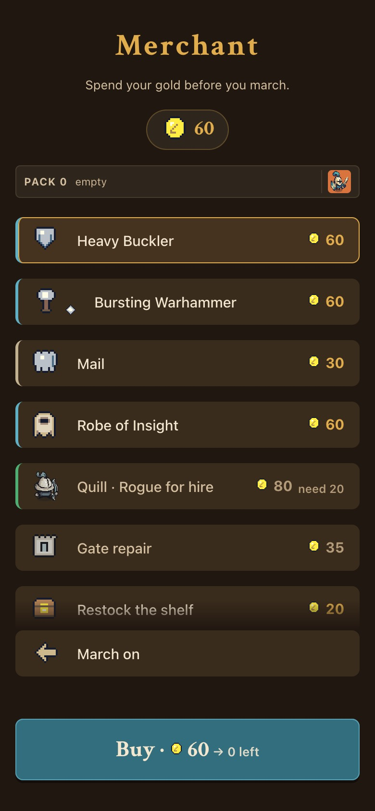 |

Critique id `0e89777d-7cda-43ca-a850-5a4ecb886d50` · round-1 re-critique `315cc62a-65d5-48db-a06f-f0c43a3d054c` · goal (confirmed by the designer): "let the player purchase items from a shop by choosing from available offers within their gold budget"

Shop screen where players weigh priced offers against their gold and buy. The gold balance that drives every decision is underplayed, one price is effectively invisible, and top chrome eats space the offer list needs.

| # | Problem | What to do | Why |
|---|---|---|---|
| 1 | **The gold balance doesn't read as the screen's key number** player's gold of 92 at the top, styled well below primary importance | Increase its size and weight so it clearly outranks the offer list as the screen's status line | Every buy decision is a comparison against the remaining budget |
| 2 | **A price is invisible against its own background** the "80" price, middle-right, #43331f on #413424 = 1.0:1, where WCAG AA needs 3:1 at this size | Lighten the number until it reaches at least 3:1 against #413424 | A player can't judge affordability on an offer whose price can't be read |
| 3 | **Banners, filters and nav crowd out the offers** 29% of the first screen is chrome — about 4.9 more items could fit | Shrink or collapse the top banner and filter row so more offers sit above the fold | Shops work by comparison; more visible offers means less scrolling to weigh prices |
| 4 | **Navigation and merchant icons are too small to recognise** unlabelled top-right icon 51x51 image px, the icon next to "March on" 47x43, +3 more by "Merchant" — house minimum 72 image px | Make these icons noticeably larger, or pair them with visible text labels | These are how players identify the vendor and exit the shop |
| 5 | **Confirm whether the dark item art is intentional** six offer images incl. Executioner Greatsword of F, Frost Axe, Buckler dark enough that subjects may be hard to make out | Confirm the style is deliberate; if not, raise brightness on the item art | Players scan offers by recognising the item before reading its price |

### Run lost · mobile 390×844

| Before | Latest build |
|---|---|
| 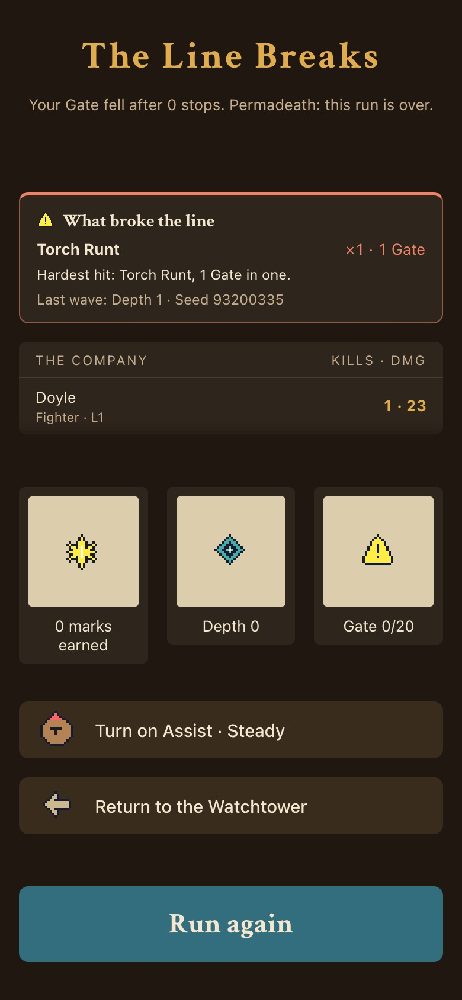 | 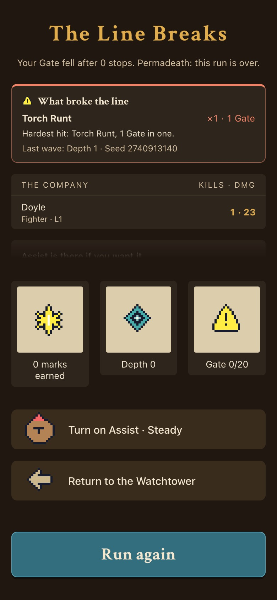 |

Critique id `bd47f544-f126-4dfd-b4cf-1e7545879ed6` · round-1 re-critique `449a6922-3edc-4946-a706-fd4e3f3db0c9` · goal (confirmed by the designer): "soften permadeath failure by providing meaningful post-mortem and stats recap, then encourage immediate retry"

Whales could not write the full critique for this screen: it lacked measurements for its two main findings (an underweighted headline and distributed focus). It gave one well-evidenced finding.

| # | Problem | What to do | Why |
|---|---|---|---|
| 1 | **13 icons are under the house minimum** the icon next to "The Line Breaks" (top-left) at 41x45 image px and the icon next to "Return to the Watchtower" (bottom-left) at 47x43 image px sit well under the 72 image px house minimum, as do the icons next to "0 marks" and "Turn on Assist - Steady" (both 55 px wide) and 9 more | Scale the whole icon set up noticeably and keep the sizes consistent across the recap and the action rows | Those icons mark the stats recap and the two exits (Assist, Watchtower), so the moment meant to make the loss legible and route players into a retry is carried by marks too small to recognise |

_Note: Partial critique. This defeat was forced (Gate HP set to 1 mid-battle), so "0 stops" and "1 Gate in one" come from that shortcut. Re-run on a real loss._
